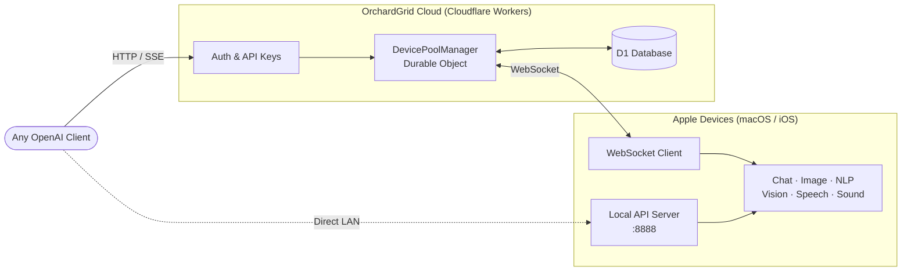

  

  <strong>Share Apple Intelligence Anywhere</strong>

  Turn your Apple devices into a distributed AI compute pool. 
  Six on-device capabilities. One OpenAI-compatible API. Zero cloud GPUs.

  
  
  

  <a href="README.md">English</a> · <a href="README.zh-CN.md">中文</a>

---

Apple Intelligence runs exclusively on Apple's Neural Engine — it cannot be deployed on traditional cloud servers. OrchardGrid bridges this gap by organizing Apple devices worldwide into a **unified, programmable AI compute pool**, exposing their capabilities through a standard API that any OpenAI-compatible client can call directly.

## Screenshots

  
  &nbsp;&nbsp;
  
  &nbsp;&nbsp;
  

  

## Architecture

**Reverse inference:** Unlike traditional AI services where the server owns the GPU, OrchardGrid's server has zero compute — it acts purely as a task coordinator. The actual inference runs on user-owned Apple devices behind NATs and firewalls. The server pushes tasks to devices via **WebSocket**, while the external API remains standard **HTTP**, fully OpenAI-compatible.

## 🧠 Capabilities

| Capability | Apple Framework | API Endpoint | Description |
|:----------:|-----------------|--------------|-------------|
| **Chat** | FoundationModels | `/v1/chat/completions` | LLM text generation with streaming & structured output |
| **Image** | ImagePlayground | `/v1/images/generations` | Text-to-image (illustration, sketch) |
| **NLP** | NaturalLanguage | `/v1/nlp/analyze` | Language detection, NER, tokenization, embeddings |
| **Vision** | Vision | `/v1/vision/analyze` | OCR, image classification, face & barcode detection |
| **Speech** | Speech | `/v1/audio/transcriptions` | Speech-to-text in 50+ languages |
| **Sound** | SoundAnalysis | `/v1/audio/classify` | Environmental sound classification (~300 categories) |

Every capability is accessible both through the **local direct API** (on your LAN) and the **cloud relay** (from anywhere).

## ✨ Features

- **OpenAI-compatible** — drop-in replacement for any OpenAI SDK, zero client-side changes
- **Dual access** — local API on your LAN, or cloud relay via Cloudflare Workers from anywhere
- **Streaming** — real-time Server-Sent Events for chat responses
- **Structured output** — full JSON Schema support for deterministic formatting
- **Per-capability toggles** — enable or disable each capability individually
- **Fault-tolerant device pool** — round-robin scheduling with time-decayed failure avoidance
- **Privacy-first** — all inference on-device; the cloud relay is a pure router with zero data storage

## 📋 Requirements

| | Minimum |
|---|---------|
| **macOS** | 26.0+ (Tahoe) |
| **iOS / iPadOS** | 26.0+ |
| **Chip** | Apple Silicon (M1+ / A17 Pro+) |
| **Apple Intelligence** | Enabled with model downloaded |
| **Xcode** | 26.0+ (building from source) |

## 🚀 Getting Started

### Install from App Store

### Build from Source

Clone the repo, open `orchardgrid-app.xcodeproj` in Xcode, and build. Requires Xcode 26.0+ with an Apple Silicon Mac.

### Cloud Sharing

1. Sign in with your Apple account in the app
2. Enable **Share to Cloud** — the device connects to OrchardGrid's relay via WebSocket
3. Generate an API key from the [dashboard](https://orchardgrid.com/dashboard/api-keys)
4. Use the cloud endpoint with any OpenAI-compatible client from anywhere

## 🛠 Tech Stack

| Layer | Technology |
|-------|-----------|
| Language | Swift 6 · strict concurrency |
| UI | SwiftUI |
| Networking | Apple Network framework (NWListener) |
| AI | FoundationModels · ImagePlayground · NaturalLanguage · Vision · Speech · SoundAnalysis |
| Cloud Backend | Cloudflare Workers · Durable Objects · D1 |
| Auth | Clerk (Apple Sign-In · JWT) |

## 🔒 Privacy

- **On-device inference** — all AI processing runs locally on the Apple Neural Engine
- **Zero data storage** — the cloud relay routes tasks without storing any content
- **No telemetry** — no personal data or AI queries are collected
- **Open source** — full transparency, audit the code yourself

## License

[BSL 1.1](LICENSE) — free to self-host and use. Commercial hosting as a competing service requires a separate license. Converts to Apache 2.0 after four years.

---

  <a href="https://orchardgrid.com">Website</a> &nbsp;·&nbsp;
  <a href="https://orchardgrid.com/docs">API Docs</a> &nbsp;·&nbsp;
  <a href="https://apps.apple.com/us/app/orchardgrid/id6754092757">App Store</a> &nbsp;·&nbsp;
  <a href="https://orchardgrid.com/dashboard">Dashboard</a>

