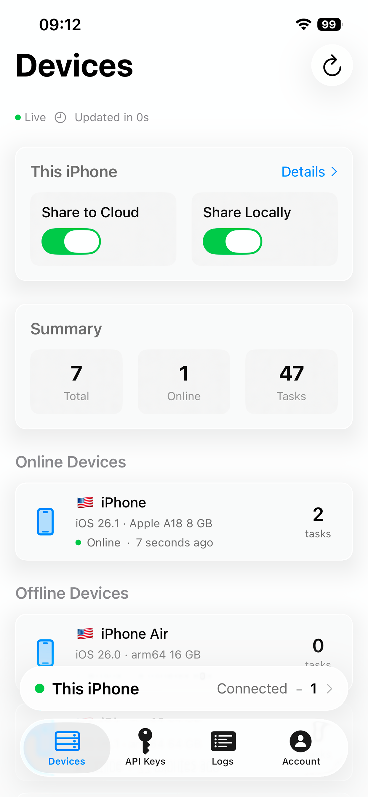
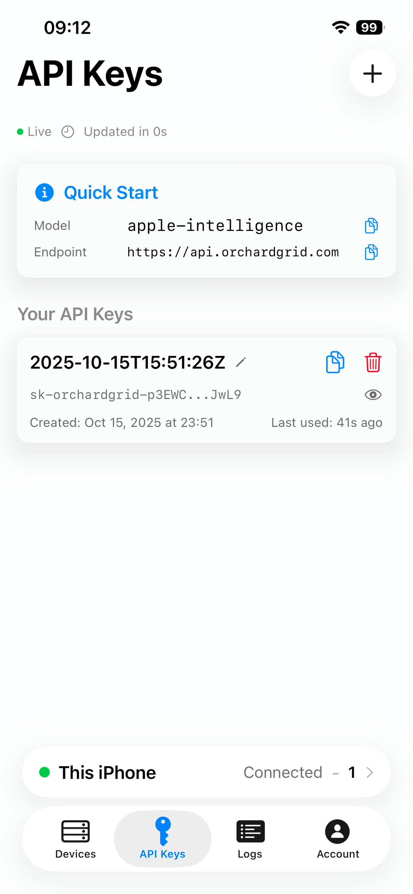
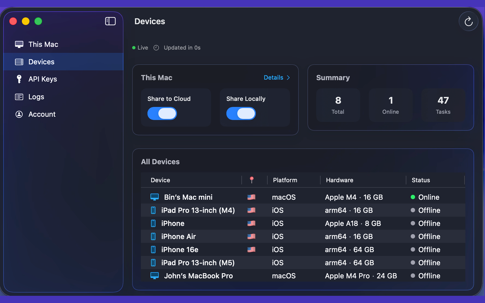
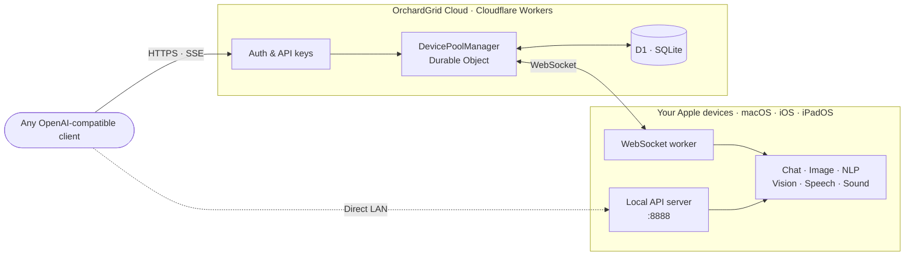

<p align="center">
  
</p>

<p align="center">
  <strong>Apple's built-in AI — from every device, for every app.</strong>
</p>

<p align="center">
  A distributed compute pool of Apple devices, six on-device capabilities,<br/>
  one OpenAI-compatible API. Menu-bar app, CLI, or HTTP — your choice.
</p>

<p align="center">
  
  
  
  
  
  
</p>

<p align="center">
  <a href="https://apps.apple.com/us/app/orchardgrid/id6754092757"><strong>App Store</strong></a> ·
  <a href="https://orchardgrid.com"><strong>Website</strong></a> ·
  <a href="https://orchardgrid.com/docs"><strong>API Docs</strong></a> ·
  <a href="https://orchardgrid.com/dashboard"><strong>Dashboard</strong></a>
</p>

<p align="center">
  <a href="README.md">English</a> · <a href="README.zh-CN.md">中文</a>
</p>

---

Apple's built-in AI runs **only on Apple's Neural Engine** — it cannot be shipped to traditional cloud GPUs. OrchardGrid turns that constraint into a feature: install the app on any Mac, iPhone, or iPad; your device becomes a node in a **programmable pool of on-device AI**, reachable over your LAN or through OrchardGrid's cloud relay. Every byte of inference happens on the devices you own.

## Screenshots

<p align="center">
  
  &nbsp;&nbsp;
  
  &nbsp;&nbsp;
  
</p>

<p align="center">
  
</p>

## ✨ Why OrchardGrid?

[`apfel`](https://github.com/Arthur-Ficial/apfel) is the closest sibling project — a UNIX-style CLI over Apple's on-device foundation model. We share the premise, then take it further on every axis: **more capabilities, more platforms, more devices, more distribution surfaces, more integration points.** Point-by-point comparison:

| Axis | [apfel](https://github.com/Arthur-Ficial/apfel) | **OrchardGrid** |
|---|:---:|:---:|
| **Apple Neural Engine / Foundation Models** | ✅ | ✅ |
| **OpenAI-compatible `/v1/*` API** | ✅ | ✅ |
| **MCP tool calling (spec 2025-06-18)** | ✅ | ✅ |
| **Streaming chat, context strategies, seed-reproducibility** | ✅ | ✅ |
| **CLI parser** | ad-hoc | **[swift-argument-parser](https://github.com/apple/swift-argument-parser)** — declarative, auto `--help`, shell completions |
| **Capabilities exposed** | Chat only | **6 capabilities**: Chat + Image (ImagePlayground) + Vision (OCR / classify / faces / barcodes) + Speech (Speech, 50+ locales) + Sound (SoundAnalysis, ~300 classes) + NLP (NaturalLanguage) |
| **Runtime platforms** | macOS | **macOS + iOS + iPadOS** — the same device pool your phone lives in |
| **Accompanying UI** | — | **Native SwiftUI menu-bar app** with live task log, device status, capability toggles |
| **Reachability of your model** | `localhost` only | **Local HTTP (`:8888`) + LAN + encrypted cloud relay** — your CI runner, teammate, or Siri Shortcut can all hit it |
| **Device pooling** | — | **Multi-device load balancing** via Cloudflare Durable Object — scale your on-device AI by adding a second Mac or iPhone |
| **Cloud API surface (optional)** | — | **`https://orchardgrid.com/v1/*`** — turn-key OpenAI-compatible endpoint routed to your own devices, zero inference dollars to a third party |
| **Authentication / key management** | — | **Clerk-backed OAuth** + API keys (inference scope + management scope) with server-side revocation |
| **Usage logs / observability** | — | **Full logs view** — every request, duration, token usage, success/failure, consumer vs. provider role |
| **Distribution: Homebrew** | ✅ (per-user tap) | ✅ (`brew install --cask bingowon/orchardgrid/orchardgrid` — app **and** CLI together) |
| **Distribution: App Store** | — | ✅ iOS / iPadOS / macOS (one install for the whole family) |
| **Auto-update** | manual `brew upgrade` | ✅ Both App Store auto-update **and** Homebrew cask auto-bumped by release pipeline |
| **Auth tokens** | — | **Fetched fresh per request** from Clerk — no stale-token foot-guns |
| **Test coverage** | unit tests | **4-tier CI**: shared-core unit (Swift Testing), CLI unit (Swift Testing), CLI integration (pytest + mock server + MCP subprocess), live smoke (real FoundationModels across all 6 capabilities) |
| **Docs** | README | **Full docs site** (`/docs`) + **auto-generated OpenAPI reference** (`/reference`) + in-repo architecture / testing / release / contributing guides |
| **Background execution** | — | **Prevents sleep while sharing** (NSProcessInfo + iOS BGTask) so your Mac keeps serving requests with the lid closed |
| **Concurrency model** | GCD / callback | **Swift 6 strict concurrency** (`@Observable`, `@MainActor`, actor-isolated managers) |
| **Commit-driven releases** | — | **Conventional Commits** → automatic version bump + DMG build + notarization + Homebrew cask update |

**What this means in practice.**

- **If you're one developer on one Mac:** `apfel` is a solid, minimal tool. Use it.
- **If anything is true of you** — you carry an iPhone, you have more than one Apple device, you want Vision / Speech / Sound / Image in addition to Chat, you want your teammate or CI runner to hit *your* on-device model, you want to give a non-technical family member an install, you want a UI to see what's actually happening, you want to pool compute across devices, you want keys you can revoke, you want an OpenAI-drop-in URL you control — **OrchardGrid is the complete platform built for that.**

OrchardGrid is a **superset**, not an alternative. Every point where apfel is "good enough" we match; every point where a real product needs more we deliver.

## 🚀 Quick Start

### 1 · Install

**Homebrew (macOS)** — one command, installs the app **and** the `og` CLI:

```bash
brew install --cask bingowon/orchardgrid/orchardgrid
```

The cask symlinks `/opt/homebrew/bin/og` into `OrchardGrid.app/Contents/Resources/og`. App and CLI share runtime state via the macOS App Group `group.com.orchardgrid.shared`.

**App Store (iOS · iPadOS · macOS)**:

<a href="https://apps.apple.com/us/app/orchardgrid/id6754092757">
  
</a>

**From source (macOS, development)** — clone, open `orchardgrid-app.xcodeproj`, build. Requires Xcode 26+.

### 2 · First prompt

```bash
og "What is the capital of Austria?"
```

That's it — the prompt runs **in-process** against `SystemLanguageModel.default`, with no local HTTP hop and no cloud round-trip.

### 3 · Share or consume — pick any combination

| You want to… | Do this |
|---|---|
| Use Apple's built-in AI from the shell | `og "..."` (or `og chat`) |
| Call it from another app via OpenAI SDK | Enable **Share Locally** → hit `http://<mac>.local:8888/v1/chat/completions` |
| Reach your Mac's AI from your iPhone / CI / a laptop | Enable **Share to Cloud** → `https://orchardgrid.com/v1/chat/completions` with your API key |
| Do image / vision / speech / sound / NLP | Hit the corresponding `/v1/*` endpoint (see [Capabilities](#-capabilities)) |

## ⌨️ The `og` CLI

`og` is a thin, opinionated shell wrapper around Apple's built-in AI. By default it runs on-device in the same process. Pass `--host` to talk to a peer or to OrchardGrid cloud instead.

### Inference

```bash
og "prompt"                              # single-shot, streamed to stdout
og chat                                # interactive REPL, Ctrl-C to quit
og model-info                          # model availability, source, context size
og -s "You are a pirate." "explain TCP"  # system prompt
og --system-file persona.txt "..."       # system prompt from file
og --permissive "creative writing..."    # relax safety guardrails
```

### Files and stdin

```bash
og -f README.md "summarise this"                    # attach a file
og -f old.swift -f new.swift "what changed?"        # multiple files
git diff HEAD~1 | og "review this diff"             # pipe stdin
cat notes.txt | og -f extra.md "merge and distil"   # stdin + files mixed
```

### Output

```bash
og -o json "one word capital of France" | jq .content
og --quiet "one word capital of France"             # no chrome, just the answer
og --no-color "..."                                 # disable ANSI colour
```

### Generation options

```bash
og --temperature 0.2 "..."                          # deterministic-ish sampling
og --max-tokens 100 "..."                           # cap completion length
og --seed 42 "..."                                  # reproducible runs
```

### Context strategy — five ways to trim long conversations

```bash
og chat --context-strategy newest-first    # default: keep the most recent turns
og chat --context-strategy oldest-first    # keep the earliest turns
og chat --context-strategy sliding-window --context-max-turns 20
og chat --context-strategy summarize       # compress old turns via a side model call
og chat --context-strategy strict          # refuse to trim — throw on overflow
```

### Tool calling via MCP (Model Context Protocol)

Attach any stdio MCP server; `og` discovers its tools, registers them natively with `LanguageModelSession`, and Apple's built-in AI decides when to call them.

```bash
og --mcp ./server.py "what is 41 + 1?"              # on-device tool call
og --mcp ./a.py --mcp ./b.py --chat                 # multiple servers
og --mcp-timeout 30 --mcp ./slow.py "..."           # per-call timeout
og mcp list ./server.py                             # introspect a server's tools
og mcp list ./server.py -o json                     # same, as JSON
```

MCP requires on-device inference — combining `--mcp` with `--host` is rejected at parse time.

### Benchmark

```bash
og benchmark                                        # 5 runs against the local model
og benchmark --runs 20 --bench-prompt "Tell me a joke"
og benchmark --host http://mac.local:8888           # benchmark a peer
og benchmark -o json --quiet | jq .tokensPerSec     # scriptable
```

Reports **min / median / p95 / max / mean** for time-to-first-token, total latency, tokens/sec, and output tokens. Respects `--temperature` and `--max-tokens`.

### Cloud account (after `og login`)

```bash
og login                            # OAuth loopback; opens browser, issues a management key
og logout                           # drop local creds
og logout --revoke                  # also revoke the key server-side

og me                               # account info
og keys                             # list API keys
og keys create --name "my-bot"      # new inference-scope key, printed once
og keys delete <hint>               # revoke an inference key
og devices                          # list your devices
og logs --role self --limit 10      # recent usage
og logs --role consumer --status failed --offset 20
```

### Remote endpoints

```bash
og --host https://orchardgrid.com --token sk-… "hi"   # cloud
og --host http://mac.local:8888 "hi"                   # LAN peer
ORCHARDGRID_HOST=https://orchardgrid.com og "hi"       # via env
```

### Diagnostics

```bash
og status                # local server state, sharing toggles, login state
og --version             # version
og --help                # full flag reference
```

Deep-dive docs: [orchardgrid.com/docs/cli-reference](https://orchardgrid.com/docs/cli-reference) · [orchardgrid.com/docs/context-strategies](https://orchardgrid.com/docs/context-strategies) · [orchardgrid.com/docs/mcp](https://orchardgrid.com/docs/mcp) · [API Reference](https://orchardgrid.com/reference) · [`demo/`](demo/) (capability-combining shell scripts).

### Environment variables

| Variable | Meaning |
|---|---|
| `ORCHARDGRID_HOST` | Default remote host (if unset, CLI runs on-device) |
| `ORCHARDGRID_TOKEN` | Default bearer token |
| `OG_NO_BROWSER` | Suppress `og login`'s auto browser launch (for SSH / CI) |
| `NO_COLOR` | Disable ANSI colour output |

### Exit codes

| Code | Meaning |
|:---:|---|
| `0` | Success |
| `1` | Runtime error (network, auth, unreachable) |
| `2` | Usage error (bad flag, conflicting options) |
| `3` | Guardrail blocked |
| `4` | Context overflow |
| `5` | Model unavailable (Apple Intelligence not enabled) |
| `6` | Rate limited |

## 🧠 Capabilities

Six on-device Apple frameworks, one consistent OpenAI-flavoured interface. Every capability is reachable through the local API (`:8888` on your LAN) and the cloud relay (`https://orchardgrid.com`).

| Capability | Framework | Endpoint | What it does |
|---|---|---|---|
| **Chat** | FoundationModels | `/v1/chat/completions` | LLM text generation, streaming, structured output, MCP tools |
| **Image** | ImagePlayground | `/v1/images/generations` | Text-to-image (illustration and sketch styles) |
| **NLP** | NaturalLanguage | `/v1/nlp/analyze` | Language detection, NER, tokenisation, embeddings |
| **Vision** | Vision | `/v1/vision/analyze` | OCR, classification, face and barcode detection |
| **Speech** | Speech | `/v1/audio/transcriptions` | Speech-to-text, 50+ languages |
| **Sound** | SoundAnalysis | `/v1/audio/classify` | Environmental sound classification, ~300 categories |

## 🌐 API access

### Local (same LAN)

Enable **Share Locally** in the app. The device listens on `:8888`:

```bash
curl http://<mac>.local:8888/v1/chat/completions \
  -H "Content-Type: application/json" \
  -d '{"model":"apple-foundationmodel","messages":[{"role":"user","content":"hi"}]}'
```

```python
from openai import OpenAI
client = OpenAI(base_url="http://mac.local:8888/v1", api_key="unused")
client.chat.completions.create(
    model="apple-foundationmodel",
    messages=[{"role": "user", "content": "Hello"}],
)
```

### Cloud (reach your devices from anywhere)

Enable **Share to Cloud** in the app, sign in, create an API key at [orchardgrid.com/dashboard/api-keys](https://orchardgrid.com/dashboard/api-keys):

```bash
curl https://orchardgrid.com/v1/chat/completions \
  -H "Authorization: Bearer sk-…" \
  -H "Content-Type: application/json" \
  -d '{"model":"apple-foundationmodel","messages":[{"role":"user","content":"hi"}]}'
```

The cloud **never sees your prompt or response** — it routes a task id to an online device with the right capability, forwards the streamed bytes through, and logs the usage counters. Zero content storage by design.

## 🏗 Architecture



**Reverse inference.** Unlike traditional AI services where the server owns the GPU, OrchardGrid's cloud has **zero compute** — it's a task router. Your devices sit behind NATs and firewalls; the server pushes tasks out over WebSocket and pipes results back. External clients see a plain HTTP + SSE API. Internally, every token is generated on hardware you own.

## 🔒 Privacy

- **100% on-device inference.** Apple's Neural Engine runs the model. Nothing leaves your device except the answer.
- **Zero content storage in the cloud.** The relay forwards bytes and counts tokens — it does not persist prompts, completions, images, or audio.
- **No telemetry.** No analytics, no crash-reporter uploading your queries.
- **Audit the code.** The app, the CLI, the worker, and the database schema are all in this organisation's repos.
- **Uninstall wipes state.** `brew uninstall --cask --zap` removes the App Group container and `~/.config/orchardgrid`.

## 📊 Honest limits

| Constraint | Detail |
|---|---|
| Context window | 4096 tokens (Apple's built-in AI hard limit) |
| Platform | Apple Silicon Macs (M1+) and Apple Intelligence-capable iPhone / iPad |
| Model | One model per modality — whatever Apple ships |
| Streaming | Chat and vision stream; image generation is one-shot |
| Guardrails | Apple's safety system may refuse benign prompts; `--permissive` helps creative tasks |
| Latency | On-device — single-digit seconds per response, no rate-limit but also no cloud GPU scale |
| MCP | Stdio transport only; remote HTTP MCP servers are on the roadmap |

## 🛠 Tech stack

| Layer | Technology |
|---|---|
| Language | Swift 6 · strict concurrency · `@MainActor` managers |
| UI | SwiftUI · macOS menu-bar + iOS navigation |
| Networking | Apple Network framework (`NWListener`) · URLSession · WebSocket |
| AI | FoundationModels · ImagePlayground · NaturalLanguage · Vision · Speech · SoundAnalysis |
| Cloud backend | Cloudflare Workers · Durable Objects · D1 (SQLite) · Hono |
| Auth | Clerk · Apple Sign-In · Bearer API keys (scoped: inference / management) |
| Distribution | Homebrew cask (app + CLI) · App Store (iOS / iPadOS / macOS) |
| CLI | Swift Package · 127 Swift Testing unit tests + 96 pytest integration tests |
| Quality gate | GitHub Actions · CLI + Xcode app run on every push and PR |

## 🤝 Contributing

Bug reports, feature ideas, pull requests — all welcome.

- **Start here**: [`docs/CONTRIBUTING.md`](docs/CONTRIBUTING.md) — dev loop, commit style, PR checklist
- **Architecture map**: [`docs/ARCHITECTURE.md`](docs/ARCHITECTURE.md) — three targets, one product
- **Test pyramid**: [`docs/TESTING.md`](docs/TESTING.md) — six tiers, where new tests go
- **Release flow**: [`docs/RELEASING.md`](docs/RELEASING.md) — Conventional Commits → notarized DMG → tap
- **Operator guide**: [`CLAUDE.md`](CLAUDE.md) — the AI / human onboarding primer

<p align="center">
  <sub>Built with Swift 6 and Apple Silicon. No cloud GPUs were harmed in the making of this AI.</sub>
</p>

<p align="center">
  <a href="https://orchardgrid.com">Website</a> &nbsp;·&nbsp;
  <a href="https://orchardgrid.com/docs">API Docs</a> &nbsp;·&nbsp;
  <a href="https://apps.apple.com/us/app/orchardgrid/id6754092757">App Store</a> &nbsp;·&nbsp;
  <a href="https://orchardgrid.com/dashboard">Dashboard</a> &nbsp;·&nbsp;
  <a href="orchardgrid-cli/README.md">CLI reference</a>
</p>
