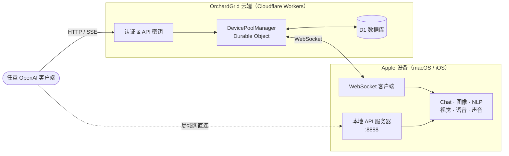

  

  <strong>随时随地共享 Apple Intelligence</strong>

  把你的 Apple 设备变成分布式 AI 算力池。 
  六项设备端 AI 能力，一套 OpenAI 兼容 API，无需云端 GPU。

  
  
  

  <a href="README.md">English</a> · <a href="README.zh-CN.md">中文</a>

---

Apple Intelligence 只能在 Apple Neural Engine 上运行，无法部署到传统云服务器。OrchardGrid 把分散在各地的 Apple 设备组织成**统一的、可编程调用的 AI 算力池**，对外暴露标准 API，任何兼容 OpenAI 的客户端都能直接调用。

## 截图

  
  &nbsp;&nbsp;
  
  &nbsp;&nbsp;
  

  

## 架构

**反向推理：** 传统 AI 服务的 GPU 在服务端，而 OrchardGrid 的服务端没有任何算力——它只是一个任务调度器。真正的推理发生在用户自己的 Apple 设备上，这些设备通常在 NAT 和防火墙之后。服务端通过 **WebSocket** 向设备推送任务，对外的 API 保持标准 **HTTP**，完全兼容 OpenAI。

## 🧠 AI 能力

| 能力 | Apple 框架 | API 端点 | 说明 |
|:----:|-----------|----------|------|
| **Chat** | FoundationModels | `/v1/chat/completions` | LLM 文本生成，支持流式和结构化输出 |
| **图像** | ImagePlayground | `/v1/images/generations` | 文字生图（插画、素描风格） |
| **NLP** | NaturalLanguage | `/v1/nlp/analyze` | 语言检测、实体识别、分词、嵌入向量 |
| **视觉** | Vision | `/v1/vision/analyze` | OCR、图像分类、人脸和条码检测 |
| **语音** | Speech | `/v1/audio/transcriptions` | 语音转文字，支持 50+ 种语言 |
| **声音** | SoundAnalysis | `/v1/audio/classify` | 环境声音分类（约 300 种类别） |

每项能力都可通过**本地直连 API**（局域网内）和**云端中继**（全球任意位置）访问。

## ✨ 核心特性

- **OpenAI 兼容** — 直接替换 OpenAI SDK 的后端地址即可使用，客户端零改动
- **双通道访问** — 局域网内直连本地 API，或通过 Cloudflare Workers 云端中继
- **流式响应** — 基于 Server-Sent Events 的实时文本输出
- **结构化输出** — 完整支持 JSON Schema，确保响应格式的确定性
- **能力开关** — 在 App 界面中独立开关每项能力
- **容错设备池** — 支持故障时间衰减的轮询调度，自动回避异常设备
- **隐私优先** — 所有推理在设备本地完成，云端中继仅做路由，不存储任何数据

## 📋 系统要求

| | 最低版本 |
|---|---------|
| **macOS** | 26.0+（Tahoe） |
| **iOS / iPadOS** | 26.0+ |
| **芯片** | Apple Silicon（M1+ / A17 Pro+） |
| **Apple Intelligence** | 已开启且模型已下载 |
| **Xcode** | 26.0+（仅源码构建需要） |

## 🚀 快速开始

### 从 App Store 安装

### 从源码构建

克隆本仓库，用 Xcode 打开 `orchardgrid-app.xcodeproj`，构建即可。需要 Xcode 26.0+ 和 Apple Silicon Mac。

### 云端共享

1. 在 App 中登录你的 Apple 账号
2. 开启 **Share to Cloud** — 设备会通过 WebSocket 连接到 OrchardGrid 中继服务
3. 在[控制台](https://orchardgrid.com/dashboard/api-keys)创建 API 密钥
4. 从全球任意位置，用任何兼容 OpenAI 的客户端调用云端接口

## 🛠 技术栈

| 层级 | 技术 |
|------|------|
| 语言 | Swift 6 · 严格并发模式 |
| UI | SwiftUI |
| 网络 | Apple Network 框架（NWListener） |
| AI | FoundationModels · ImagePlayground · NaturalLanguage · Vision · Speech · SoundAnalysis |
| 云端后端 | Cloudflare Workers · Durable Objects · D1 |
| 认证 | Clerk（Apple 登录 · JWT） |

## 🔒 隐私

- **设备端推理** — 所有 AI 处理在 Apple Neural Engine 上本地完成
- **零数据存储** — 云端中继仅做任务路由，不存储任何内容
- **无数据采集** — 不收集任何个人数据或 AI 请求内容
- **开源透明** — 代码完全公开，欢迎审计

## 🤝 参与贡献

无论是修复 Bug、添加新功能还是完善文档，我们都非常欢迎你的参与。

1. Fork 本仓库，从 `main` 创建你的分支
2. 完成修改，并在真机上测试
3. 提交 Pull Request，简要说明改了什么、为什么改

不知道从哪开始？看看 [Issues](https://github.com/BingoWon/orchardgrid-app/issues) 里有没有感兴趣的，或者直接开一个 Issue 聊聊你的想法。

---

  <a href="https://orchardgrid.com">官网</a> &nbsp;·&nbsp;
  <a href="https://orchardgrid.com/docs">API 文档</a> &nbsp;·&nbsp;
  <a href="https://apps.apple.com/us/app/orchardgrid/id6754092757">App Store</a> &nbsp;·&nbsp;
  <a href="https://orchardgrid.com/dashboard">控制台</a>

