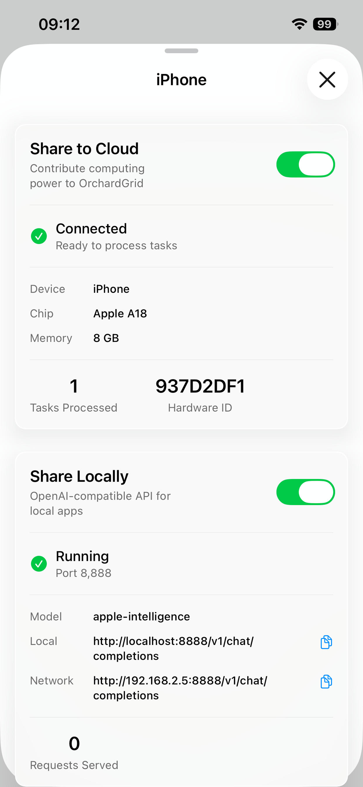
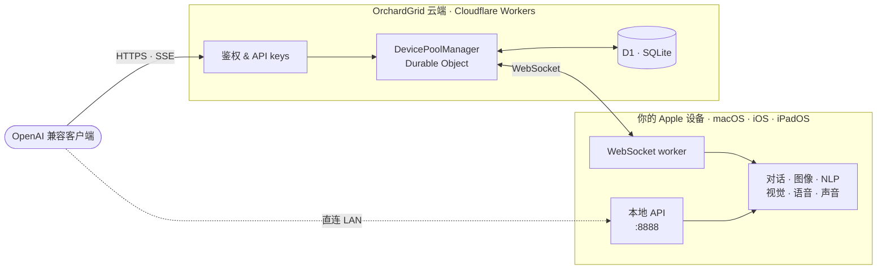

<p align="center">
  
</p>

<p align="center">
  <strong>Apple Intelligence —— 跨设备、跨应用,开箱即用。</strong>
</p>

<p align="center">
  一个由 Apple 设备组成的分布式算力池,六项设备端 AI 能力,<br/>
  一套 OpenAI 兼容 API。菜单栏 App、命令行、HTTP —— 随你选。
</p>

<p align="center">
  
  
  
  
  
  
</p>

<p align="center">
  <a href="https://apps.apple.com/us/app/orchardgrid/id6754092757"><strong>App Store</strong></a> ·
  <a href="https://orchardgrid.com"><strong>官网</strong></a> ·
  <a href="https://orchardgrid.com/docs"><strong>API 文档</strong></a> ·
  <a href="https://orchardgrid.com/dashboard"><strong>控制台</strong></a>
</p>

<p align="center">
  <a href="README.md">English</a> · <a href="README.zh-CN.md">中文</a>
</p>

---

Apple Intelligence **只能在 Apple 自家的 Neural Engine 上运行** —— 没法像普通模型那样塞进云端 GPU。OrchardGrid 把这个限制变成了优势:在任意 Mac / iPhone / iPad 上装一次,你的设备就成了**可编程 AI 算力池**中的一个节点,局域网内可直连,外网通过 OrchardGrid 的云端中继可达。每一字节的推理,都发生在你自己的设备上。

## 截图

<p align="center">
  
  &nbsp;&nbsp;
  
  &nbsp;&nbsp;
  
</p>

<p align="center">
  
</p>

## ✨ 为什么选 OrchardGrid

本地 AI 项目通常得做取舍,OrchardGrid 不需要。

| | 云端 LLM API | [Ollama](https://ollama.com) | [apfel](https://github.com/Arthur-Ficial/apfel) | **OrchardGrid** |
|---|:---:|:---:|:---:|:---:|
| 设备端推理 | ❌ | ✅ | ✅ | ✅ |
| 使用 Apple Neural Engine / 官方基础模型 | ❌ | ❌ | ✅ | ✅ |
| 除对话外的能力(图像·视觉·语音·声音·NLP) | 因厂商而异 | ❌ | ❌ | **✅ 六项全支持** |
| 原生支持 iOS / iPadOS | 仅浏览器 | ❌ | ❌ | ✅ |
| 菜单栏 App(不只是 CLI) | — | — | — | ✅ |
| 把多台设备聚合成一个 API | ❌ | ❌ | ❌ | ✅ |
| 任意位置可达(手机、CI、同事的电脑) | ✅ | 仅 localhost | 仅 localhost | ✅ |
| OpenAI 兼容 `/v1/*` | ✅ | ✅ | ✅ | ✅ |
| MCP 工具调用 | 因厂商而异 | ❌ | ✅ | ✅ |
| 免费 | ❌ | ✅ | ✅ | ✅ |

**一句话总结**。如果你只有一台 Mac,只想用命令行跑 Apple Intelligence —— `apfel` 很优秀,放心用。如果你想让**同一个模型**也能**从 iPhone 调用**、也能走**图像 / 视觉 / 语音 / 声音 / NLP**、也能**作为统一 API 分享给团队**、也能**让家人从 App Store 装个菜单栏 App 直接用** —— 那就是 OrchardGrid。

## 🚀 快速上手

### 1 · 安装

**Homebrew(macOS)** —— 一条命令同时装 App 和 `og` CLI:

```bash
brew install --cask bingowon/orchardgrid/orchardgrid
```

cask 会把 `/opt/homebrew/bin/og` 软链到 `OrchardGrid.app/Contents/Resources/og`。App 和 CLI 通过 macOS App Group `group.com.orchardgrid.shared` 共享运行状态。

**App Store(iOS · iPadOS · macOS)**:

<a href="https://apps.apple.com/us/app/orchardgrid/id6754092757">
  
</a>

**从源码构建(macOS,开发用)** —— 克隆仓库,打开 `orchardgrid-app.xcodeproj`,构建。需要 Xcode 26+。

### 2 · 第一次对话

```bash
og "奥地利的首都是哪里?"
```

就这样 —— 命令直接在进程内调用 `SystemLanguageModel.default`,**不走本地 HTTP**,**不走云端**。

### 3 · 自用或分享 —— 任意组合

| 你想要 | 这样做 |
|---|---|
| 从终端调 Apple Intelligence | `og "..."`(或 `og --chat`) |
| 让别的程序用 OpenAI SDK 调 | 开启 **本地分享** → 访问 `http://<mac>.local:8888/v1/chat/completions` |
| 从手机 / CI / 别的电脑反向调你 Mac 的 AI | 开启 **云端分享** → `https://orchardgrid.com/v1/chat/completions` + API key |
| 用图像 / 视觉 / 语音 / 声音 / NLP | 调对应的 `/v1/*` 端点(见 [能力一览](#-能力一览)) |

## ⌨️ `og` CLI

`og` 是一个对 Apple Intelligence 极简、直观的 shell 封装。默认进程内 on-device 运行。加 `--host` 可指向 LAN 对等设备或 OrchardGrid 云端。

### 推理

```bash
og "prompt"                              # 单次,流式输出到 stdout
og --chat                                # 交互式 REPL,Ctrl-C 退出
og --model-info                          # 模型可用性、来源、上下文大小
og -s "你是一位海盗。" "解释 TCP"         # 系统提示
og --system-file persona.txt "..."       # 从文件读系统提示
og --permissive "创意写作..."             # 放宽安全护栏
```

### 文件与 stdin

```bash
og -f README.md "总结一下"                          # 附加文件
og -f old.swift -f new.swift "有什么变化?"          # 多文件
git diff HEAD~1 | og "review 这个 diff"             # 管道输入
cat notes.txt | og -f extra.md "合并并提炼"         # stdin + 文件 混用
```

### 输出

```bash
og -o json "法国首都,一个词" | jq .content
og --quiet "法国首都,一个词"                        # 去掉装饰,只留答案
og --no-color "..."                                # 关闭 ANSI 颜色
```

### 生成选项

```bash
og --temperature 0.2 "..."                         # 近似确定性采样
og --max-tokens 100 "..."                          # 限制输出长度
og --seed 42 "..."                                 # 可复现运行
```

### 上下文策略 —— 五种长对话裁剪方案

```bash
og --chat --context-strategy newest-first    # 默认:保留最近若干轮
og --chat --context-strategy oldest-first    # 保留最早若干轮
og --chat --context-strategy sliding-window --context-max-turns 20
og --chat --context-strategy summarize       # 调用一次子会话摘要旧内容
og --chat --context-strategy strict          # 不裁剪 —— 超长直接报错
```

### MCP 工具调用(Model Context Protocol)

传入任何 stdio MCP server,`og` 会发现其工具、用 `LanguageModelSession` 原生注册,Apple Intelligence 自行决定何时调用。

```bash
og --mcp ./server.py "41 + 1 是多少?"               # 设备端工具调用
og --mcp ./a.py --mcp ./b.py --chat                 # 多个 server
og --mcp-timeout 30 --mcp ./slow.py "..."           # 单次调用超时
og mcp list ./server.py                             # 查看 server 的工具目录
og mcp list ./server.py -o json                     # 同上,JSON 格式
```

MCP 要求设备端推理 —— `--mcp` 和 `--host` 同时出现会在解析期被拒绝。

### 性能基准

```bash
og benchmark                                        # 本地模型跑 5 次
og benchmark --runs 20 --bench-prompt "讲个笑话"
og benchmark --host http://mac.local:8888           # 对 LAN 对等设备跑基准
og benchmark -o json --quiet | jq .tokensPerSec     # 可脚本化
```

输出 ttft / 总耗时 / tokens/sec / 输出 token 的 **min · median · p95 · max · mean**。遵循 `--temperature` 和 `--max-tokens`。

### 云端账户(`og login` 之后可用)

```bash
og login                            # OAuth loopback,浏览器授权,签发管理 key
og logout                           # 清本地凭据
og logout --revoke                  # 同时吊销服务器端 key

og me                               # 账户信息
og keys                             # 列 API keys
og keys create --name "my-bot"      # 新建推理 key,只打印一次
og keys delete <hint>               # 吊销推理 key
og devices                          # 列你的设备
og logs --role self --limit 10      # 近期用量
og logs --role consumer --status failed --offset 20
```

### 远程端点

```bash
og --host https://orchardgrid.com --token sk-… "hi"   # 云端
og --host http://mac.local:8888 "hi"                   # LAN 对等
ORCHARDGRID_HOST=https://orchardgrid.com og "hi"       # 环境变量形式
```

### 诊断

```bash
og status                # 本机服务状态、分享开关、登录状态
og --version             # 版本
og --help                # 完整 flag 参考
```

深入文档:[`docs/cli-reference.md`](docs/cli-reference.md) · [`docs/openai-api-compatibility.md`](docs/openai-api-compatibility.md) · [`docs/context-strategies.md`](docs/context-strategies.md) · [`demo/`](demo/) 多能力组合脚本。

### 环境变量

| 变量 | 含义 |
|---|---|
| `ORCHARDGRID_HOST` | 默认远程 host(未设置则 CLI 走 on-device) |
| `ORCHARDGRID_TOKEN` | 默认 Bearer token |
| `OG_NO_BROWSER` | `og login` 不自动拉起浏览器(适合 SSH / CI) |
| `NO_COLOR` | 关闭 ANSI 颜色 |

### 退出码

| Code | 含义 |
|:---:|---|
| `0` | 成功 |
| `1` | 运行时错误(网络 / 鉴权 / 不可达) |
| `2` | 用法错误(flag 错 / 冲突) |
| `3` | 被安全护栏拦下 |
| `4` | 上下文溢出 |
| `5` | 模型不可用(Apple Intelligence 未启用) |
| `6` | 被限流 |

## 🧠 能力一览

六项 Apple 设备端框架,一套统一的 OpenAI 风格接口。每项能力都能通过本地 API(`:8888`)或云端中继(`https://orchardgrid.com`)访问。

| 能力 | 框架 | 端点 | 作用 |
|---|---|---|---|
| **对话** | FoundationModels | `/v1/chat/completions` | LLM 文本生成、流式、结构化输出、MCP 工具 |
| **图像** | ImagePlayground | `/v1/images/generations` | 文生图(插画和素描风格) |
| **NLP** | NaturalLanguage | `/v1/nlp/analyze` | 语言识别、命名实体、分词、嵌入 |
| **视觉** | Vision | `/v1/vision/analyze` | OCR、图像分类、人脸、条码 |
| **语音** | Speech | `/v1/audio/transcriptions` | 语音转文字,50+ 语言 |
| **声音** | SoundAnalysis | `/v1/audio/classify` | 环境声音分类,约 300 类 |

## 🌐 API 访问

### 本地(同一 LAN)

在 App 里开启 **本地分享**,设备会监听 `:8888`:

```bash
curl http://<mac>.local:8888/v1/chat/completions \
  -H "Content-Type: application/json" \
  -d '{"model":"apple-foundationmodel","messages":[{"role":"user","content":"hi"}]}'
```

```python
from openai import OpenAI
client = OpenAI(base_url="http://mac.local:8888/v1", api_key="unused")
client.chat.completions.create(
    model="apple-foundationmodel",
    messages=[{"role": "user", "content": "你好"}],
)
```

### 云端(从任何地方调你的设备)

在 App 里开启 **云端分享**,登录账户,到 [orchardgrid.com/dashboard/api-keys](https://orchardgrid.com/dashboard/api-keys) 创建 API key:

```bash
curl https://orchardgrid.com/v1/chat/completions \
  -H "Authorization: Bearer sk-…" \
  -H "Content-Type: application/json" \
  -d '{"model":"apple-foundationmodel","messages":[{"role":"user","content":"你好"}]}'
```

云端**不会看到你的 prompt 或回复** —— 它只负责把 task id 路由到一台拥有对应能力的在线设备,把流式字节原样穿过,并记录计费所需的计数。**零内容存储** 是设计约束。

## 🏗 架构



**反向推理**。传统 AI 服务的服务器自己拥有 GPU,OrchardGrid 云端**算力为零** —— 它是一个 task router。你的设备在 NAT / 防火墙后,服务器通过 WebSocket 把任务推出去、把结果管道回来。外部客户端看到的是普通的 HTTP + SSE;内部每一个 token 都在你自己的硬件上生成。

## 🔒 隐私

- **100% 设备端推理。** 所有模型调用走 Apple Neural Engine,只有最终结果离开设备。
- **云端零内容存储。** 中继只转发字节、统计 token 数,不落盘 prompt、completion、图像或音频。
- **零埋点。** 没有分析、没有把查询上传到崩溃上报。
- **代码可审计。** App、CLI、Worker、数据库 schema 全部开源在本组织。
- **卸载即清理。** `brew uninstall --cask --zap` 会删除 App Group 容器和 `~/.config/orchardgrid`。

## 📊 诚实的限制

| 约束 | 细节 |
|---|---|
| 上下文窗口 | 4096 tokens(Apple Intelligence 硬限制) |
| 平台 | Apple Silicon Mac(M1+)、支持 Apple Intelligence 的 iPhone / iPad |
| 模型 | 每项能力只有一个 —— 以 Apple 的为准 |
| 流式 | 对话和视觉流式;图像生成一次性返回 |
| 安全护栏 | Apple 的安全系统可能拒绝善意 prompt,创意任务可加 `--permissive` |
| 延迟 | 设备端,单次回答在个位数秒级,不限速也不是云端 GPU 的吞吐 |
| MCP | 仅支持 stdio 传输;远程 HTTP MCP 在路线图上 |

## 🛠 技术栈

| 层 | 技术 |
|---|---|
| 语言 | Swift 6 · 严格并发 · `@MainActor` managers |
| UI | SwiftUI · macOS 菜单栏 + iOS 导航 |
| 网络 | Apple Network framework(`NWListener`)· URLSession · WebSocket |
| AI | FoundationModels · ImagePlayground · NaturalLanguage · Vision · Speech · SoundAnalysis |
| 云端后端 | Cloudflare Workers · Durable Objects · D1(SQLite)· Hono |
| 鉴权 | Clerk · Apple Sign-In · Bearer API key(scope: inference / management) |
| 分发 | Homebrew cask(App + CLI)· App Store(iOS / iPadOS / macOS) |
| CLI | Swift Package · 127 Swift Testing 单元测试 + 96 pytest 集成测试 |
| 质量守门 | GitHub Actions · 每次 push / PR 自动跑 CLI + Xcode 测试 |

## 🤝 贡献

Bug 反馈、新功能建议、PR —— 都欢迎。

1. fork 仓库,从 `main` 切分支。
2. 提交遵循 [Conventional Commits](https://www.conventionalcommits.org)(`feat:` / `fix:` / `perf:` / `refactor:`) —— 自动发版流水线靠这个识别版本变更。
3. 提 PR 前跑 `make format`(Swift)和 `make test`。
4. 说明**为什么**,不仅是**做了什么**。

刚接触代码?从 [CLAUDE.md](CLAUDE.md) —— 操作员指南 —— 开始,然后直接 grep 仓库。

<p align="center">
  <sub>由 Swift 6 和 Apple Silicon 构建。制作本 AI 过程中没有云端 GPU 受到伤害。</sub>
</p>

<p align="center">
  <a href="https://orchardgrid.com">官网</a> &nbsp;·&nbsp;
  <a href="https://orchardgrid.com/docs">API 文档</a> &nbsp;·&nbsp;
  <a href="https://apps.apple.com/us/app/orchardgrid/id6754092757">App Store</a> &nbsp;·&nbsp;
  <a href="https://orchardgrid.com/dashboard">控制台</a> &nbsp;·&nbsp;
  <a href="orchardgrid-cli/README.md">CLI 参考</a>
</p>
